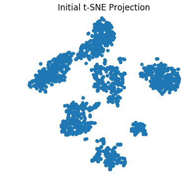

```python
import os
import numpy as np
import warnings
import sys
from scipy.stats import mode
from sklearn.decomposition import PCA
from sklearn.metrics import accuracy_score, confusion_matrix
from sklearn import neighbors
import skimage
from skimage.io import imread
from keras.models import Model
from keras import backend as K
from keras.applications.vgg16 import VGG16, preprocess_input
from webcolors import hex_to_rgb
import matplotlib
import matplotlib.pyplot as plt
from matplotlib.colors import ListedColormap
from matplotlib.cm import coolwarm

neu_raw = os.path.join('..','data','images')
results = os.path.join('..','results')
vgg_weights = os.path.join('..','support','vgg16_weights_tf_dim_ordering_tf_kernels.h5')

# Import some helper functions
sys.path.append(os.path.join('..','support'))
from data import get_files, image_tensor, image_montage, kmeans, plot_confusion_matrix
# Import t-SNE (wrapper by B.L. DeCost)
sys.path.append(os.path.join('..','support'))
from ntsne import ntsne

%matplotlib inline
%load_ext autoreload
%autoreload 2
```

    Using TensorFlow backend.


```python
image_path = get_files(neu_raw, '*.png')
N = 1800 # all images

seed = 2
np.random.seed(seed) # Use the same seed for shuffling if you want to load data from file later on
np.random.shuffle(image_path)
train_image_paths = image_path[0:N]

train_images = [imread(image_path, as_grey=True) for image_path in train_image_paths]
shapes = np.unique([str(image.shape) for image in train_images])
idx = np.random.choice(N)
plt.imshow(train_images[idx],cmap='gray')
print('Index from random choice in test set: {}'.format(idx))
```

    Index from random choice in test set: 1409


```python
# instantiate VGG16 CNN with Keras
cnn = VGG16(include_top=True, weights=None) # If your computer can connect to the Internet, replace None with 'imagenet' for ImageNet weights
cnn.load_weights(vgg_weights)
model = Model(
    inputs=cnn.input,
    outputs=cnn.get_layer('fc1').output #fully connected layers 
)

#prepare tensor of whole dataset
#list of image tensors of shape (1, 224, 224, 3)
# inputs = [image_tensor(image) for image in train_images]
with warnings.catch_warnings():
    warnings.simplefilter("ignore")
    inputs = [image_tensor(image) for image in train_images]

#concatenate image tensors along first dimension
i = np.concatenate(inputs,axis=0)
```


```python
n_images = len(train_images)
from scipy.misc import imresize
I = [
    imresize(i[idx], (224,224))
    for idx in range(n_images)
]
I = np.array(I)
```


```python
# Generate feature descriptors
fc1 = model.predict(I, verbose=True)

# Save fully connected features
feature_path = os.path.join(results, 'fc1_features.npy')
np.save(feature_path, fc1)
```

    1800/1800 [==============================] - 220s   


```python
# Option if already saved features
# Be sure to use the same randomization seed for shuffing
# Otherwise it's just a big jumbled mess down the road
# fc1 = np.load(os.path.join(results, 'fc1_features.npy'))
```


```python
# PCA dimensionality reduction to 50 components
pca_model = PCA(n_components=50) #default in tsne code. Acts as sort of regularization. Makes computation of distance matrix cheaper
x_pca = pca_model.fit_transform(fc1) #this model can handle millions of points!

# t-SNE projection from PC dimensionality to 2-D
x_tsne = ntsne.tsne(x_pca)
```


```python
# plot PCA: first three PCs
matplotlib.rcParams['font.size'] = 14
plt.figure(figsize=(6,6))
plt.scatter(x_pca[:,0], x_pca[:,1], c=x_pca[:,2])
plt.axis('equal')
plt.xlabel('first latent dimension')
plt.ylabel('second latent dimension')
plt.colorbar(cmap=coolwarm, orientation="vertical", label='third latent dimension')
plt.title('PCA on NEU Database')
# plt.savefig(os.path.join(results, 'pca_first_three.png'))
plt.show();
```


```python
# plot the first t-SNE projection
plt.figure(figsize=(6,6))
plt.scatter(x_tsne[:,0],x_tsne[:,1])
plt.axis('equal') #sets axis scale in pixels to be same for x and y
plt.axis('off')
plt.title('Initial t-SNE Projection')
plt.show()
```





```python
# Iterate with several t-SNE projections; select the best one (minimize loss)
x_tsne = ntsne.best_tsne(x_pca,theta=0.5, perplexity=30, map_dims=2, max_iter=1000, seed=None, n_repeats=10)
```


```python
# Save principal components and tsne results
pc_path = os.path.join(results, 'fc1_pc.npy')
tsne_path = os.path.join(results, 'fc1_tsne.npy')
np.save(pc_path, x_pca)
np.save(tsne_path, x_tsne)
```


```python
# plot the best t-SNE projection
plt.figure(figsize = (10,10))
plt.scatter(x_tsne[:,0],x_tsne[:,1])
plt.axis('equal') #sets axis scale in pixels to be same for x and y
plt.axis('off')
plt.savefig(os.path.join(results, 'tsne.png'))
plt.show()
```


```python
image_paths = get_files(neu_raw)

# Create color maps
cmap_light = ListedColormap(['#FFAAAA', '#FFD5AA', '#FFFDAA', '#AAFFB3', '#AAFAFF', '#F3AAFF'])
cmap_bold = ListedColormap(['#FF0000', '#FF8100', '#FFF900', '#00FF1B', '#00EDFC', '#D800FC'])

colormap = ['#FF0000', '#FF8100', '#FFF900', '#00FF1B', '#00EDFC', '#D800FC']
red =     [x / 255.0 for x in list(hex_to_rgb(colormap[0]))]
orange =  [x / 255.0 for x in list(hex_to_rgb(colormap[1]))]
yellow =  [x / 255.0 for x in list(hex_to_rgb(colormap[2]))]
green =   [x / 255.0 for x in list(hex_to_rgb(colormap[3]))]
blue =    [x / 255.0 for x in list(hex_to_rgb(colormap[4]))]
purple =  [x / 255.0 for x in list(hex_to_rgb(colormap[5]))]

defects = {}
colors = [np.array([1.,0.0,0.0]) for image in train_image_paths]
y = np.zeros(len(train_image_paths)) # y will be used for labels data
for idx, path in enumerate(train_image_paths):
    defect = os.path.split(path)[1][:2]
    
    if defect == 'RS':
        colors[idx] = red
        y[idx] = 0
    elif defect == 'Pa':
        colors[idx] = orange
        y[idx] = 1
    elif defect == 'Cr':
        colors[idx] = yellow
        y[idx] = 2
    elif defect == 'PS':
        colors[idx] = green
        y[idx] = 3
    elif defect == 'In':
        colors[idx] = blue
        y[idx] = 4
    elif defect == 'Sc':
        colors[idx] = purple
        y[idx] = 5
    else:
        colors[idx] = np.array([0.0, 0.0, 0.0])
        y[idx] = 6

mont = image_montage(x_tsne, train_image_paths, colors, mapsize=8192, thumbsize=256, bordersize=4, verbose=False)
```


```python
mont_file = os.path.join(results, 'neu_montage_fc1.png')
with warnings.catch_warnings():
    warnings.simplefilter("ignore")
    skimage.io.imsave(mont_file, mont)
```


```python
matplotlib.rcParams['font.size'] = 14

plt.figure(figsize = (10,10))
plt.scatter(x_tsne[:,0],x_tsne[:,1], c=y, cmap=cmap_bold)
plt.axis('equal') #sets axis scale in pixels to be same for x and y
plt.axis('off')

colors = ['#FF0000', '#FF8100', '#FFF900', '#00FF1B', '#00EDFC', '#D800FC']
labels = ['RS', 'Pa', 'Cr', 'PS', 'In', 'Sc']
dummies = [plt.plot([], [], c=c, marker='o', ls='')[0] for c in colors]
plt.legend(dummies, labels, loc='best')
plt.axis('off')
plt.title('t-SNE on NEU database')
plt.savefig(os.path.join(results,'tsne_color.png'))
plt.show()
```


# Nearest Neighbor Classification


```python
n_neighbors = 15

X = x_tsne
# y = y # already established, these are the true labels
# labs will be used for predicted labels with kmeans

h = 0.2 # mesh step size
```


```python
X = x_tsne
labs = kmeans(X, n_clusters=6, n_iter=100)

matplotlib.rcParams['font.size'] = 14

for weights in ['uniform', 'distance']:
    # we create an instance of Neighbours Classifier and fit the data.
    clf = neighbors.KNeighborsClassifier(n_neighbors, weights=weights)
    clf.fit(X, labs)

    # Plot the decision boundary. For that, we will assign a color to each
    # point in the mesh [x_min, x_max]x[y_min, y_max].
    x_min, x_max = X[:, 0].min() - 1, X[:, 0].max() + 1
    y_min, y_max = X[:, 1].min() - 1, X[:, 1].max() + 1
    xx, yy = np.meshgrid(np.arange(x_min, x_max, h),
                         np.arange(y_min, y_max, h))
    Z = clf.predict(np.c_[xx.ravel(), yy.ravel()])
    
    ZZ = np.zeros(Z.shape)

    dif = {}
    dif['0'] = mode(labs[labs==0] - y[labs==0])[0][0]
    dif['1'] = mode(labs[labs==1] - y[labs==1])[0][0]
    dif['2'] = mode(labs[labs==2] - y[labs==2])[0][0]
    dif['3'] = mode(labs[labs==3] - y[labs==3])[0][0]
    dif['4'] = mode(labs[labs==4] - y[labs==4])[0][0]
    dif['5'] = mode(labs[labs==5] - y[labs==5])[0][0]

    ZZ[Z==0] = Z[Z==0] - dif['0'] # 2
    ZZ[Z==1] = Z[Z==1] - dif['1'] # 5
    ZZ[Z==2] = Z[Z==2] - dif['2'] # 4
    ZZ[Z==3] = Z[Z==3] - dif['3'] # 1
    ZZ[Z==4] = Z[Z==4] - dif['4'] # 3
    ZZ[Z==5] = Z[Z==5] - dif['5'] # 0

    # Put the result into a color plot
    Z = ZZ.reshape(xx.shape)
    plt.figure(figsize=(10,10))
    plt.pcolormesh(xx, yy, Z, cmap=cmap_light)

    # Plot also the training points
    plt.scatter(X[:, 0], X[:, 1], c=y, cmap=cmap_bold,
                edgecolor='k', s=20)
    plt.xlim(xx.min(), xx.max())
    plt.ylim(yy.min(), yy.max())
    plt.title("6-Class classification (k = %i, weights = '%s')"
              % (n_neighbors, weights))

    
    colors = ['#FF0000', '#FF8100', '#FFF900', '#00FF1B', '#00EDFC', '#D800FC']
    labels = ['RS', 'Pa', 'Cr', 'PS', 'In', 'Sc']
    dummies = [plt.plot([], [], c=c, marker='o', ls='')[0] for c in colors]
    plt.legend(dummies, labels, loc='best')
    plt.axis('off')
plt.show()
```


```python
# plot confusion matrices
labs2 = np.zeros(labs.shape)
labs2[labs==0] = labs[labs==0] - dif['0'] # 2
labs2[labs==1] = labs[labs==1] - dif['1'] # 5
labs2[labs==2] = labs[labs==2] - dif['2'] # 4
labs2[labs==3] = labs[labs==3] - dif['3'] # 1
labs2[labs==4] = labs[labs==4] - dif['4'] # 3
labs2[labs==5] = labs[labs==5] - dif['5'] # 0

class_names = np.array(['RS', 'Pa', 'Cr', 'PS', 'In', 'Sc'])

# Compute confusion matrix
cnf_matrix = confusion_matrix(y, labs2)
np.set_printoptions(precision=2)

# Plot non-normalized confusion matrix
plt.figure(figsize=(6,6))
plot_confusion_matrix(cnf_matrix, classes=class_names,
                      title='Confusion matrix, without normalization')
plt.savefig(os.path.join(results, 'conf_mat.png'))

# Plot normalized confusion matrix
plt.figure(figsize=(6,6))
plot_confusion_matrix(cnf_matrix, classes=class_names, normalize=True,
                      title='Normalized confusion matrix')
plt.savefig(os.path.join(results, 'conf_mat_norm.png'))

plt.show()
```

    Confusion matrix, without normalization
    [[298   0   2   0   0   0]
     [  0 300   0   0   0   0]
     [  0   0 300   0   0   0]
     [  0   0  17 283   0   0]
     [  4   0   0   8 288   0]
     [  0   0   0   0   3 297]]
    Normalized confusion matrix
    [[ 0.99  0.    0.01  0.    0.    0.  ]
     [ 0.    1.    0.    0.    0.    0.  ]
     [ 0.    0.    1.    0.    0.    0.  ]
     [ 0.    0.    0.06  0.94  0.    0.  ]
     [ 0.01  0.    0.    0.03  0.96  0.  ]
     [ 0.    0.    0.    0.    0.01  0.99]]


```python
print('The classification accuracy is: {:.3f}'.format(accuracy_score(y, labs2)))
```

    The classification accuracy is: 0.981

